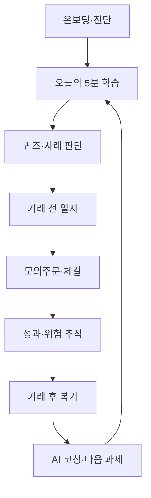
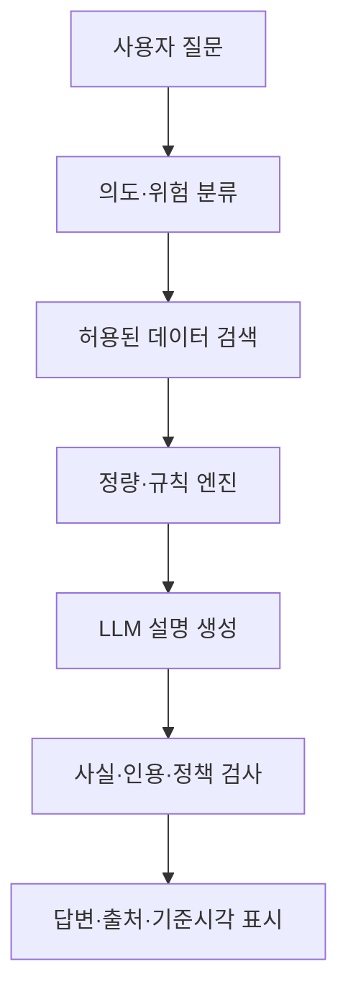
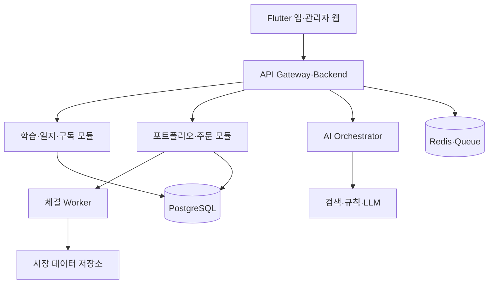

# AI 투자교육·모의투자·투자일지 코칭 앱 개발 명세서

> 문서 상태: v1.0 / 구현 기준 초안  
> 작성일: 2026-08-16  
> 대상: 제품기획자, UX 디자이너, 모바일·백엔드·데이터·AI 개발자, QA, 금융 컴플라이언스 담당자

---

## 1. 문서 목적

이 문서는 초보 투자자가 실제 자금을 위험에 노출하지 않고 투자 원리와 의사결정 과정을 익힐 수 있는 앱의 전체 제품·기술 명세다. 개발팀은 이 문서를 기준으로 요구사항을 이슈와 스프린트로 분해하고, MVP를 설계·구현·검증한다.

제품의 세 축은 다음과 같다.

1. **AI 투자교육**: 짧은 학습, 퀴즈, 사례와 AI 질의응답을 결합한다.
2. **정교한 모의투자**: 실제 시장의 가격·비용·체결 제약을 최대한 현실적으로 재현한다.
3. **투자일지 코칭**: 거래 전 판단과 거래 후 결과를 비교하여 행동편향과 원칙 준수도를 코칭한다.

### 1.1 제품의 법적·운영상 경계

MVP는 교육과 모의투자만 제공한다.

- 고객의 실제 자금을 입금·보관·운용하지 않는다.
- 실제 증권 주문을 접수하거나 중개하지 않는다.
- 증권계좌에 주문 권한으로 연결하지 않는다.
- 개인별 종목 매수·매도 지시나 수익 보장을 제공하지 않는다.
- 모든 포트폴리오와 손익은 가상자금임을 명확히 표시한다.
- AI 결과는 교육용 설명이며 사용자가 직접 검증하도록 출처와 기준시각을 제공한다.

향후 실제 투자 연동은 별도 프로젝트로 분리하고, 금융회사 제휴 및 법률 검토 후 진행한다.

---

## 2. 제품 비전과 핵심 가치

### 2.1 비전

초보자가 종목을 맞히는 법이 아니라 **근거를 세우고, 위험을 제한하고, 자신의 판단을 복기하는 법**을 배우게 한다.

### 2.2 핵심 가치 제안

| 사용자 문제 | 제공 가치 |
|---|---|
| 투자 용어와 자료가 어렵다 | 3~7분 단위의 쉬운 설명과 AI 튜터 |
| 실제 돈으로 연습하기 두렵다 | 실제 비용과 체결을 반영한 모의투자 |
| 매수·매도의 이유를 잊는다 | 거래 전·후 투자일지와 자동 비교 |
| 같은 실수를 반복한다 | 거래 행동편향 탐지와 개선 과제 |
| 수익만 보고 실력을 판단한다 | 과정·위험관리·원칙 준수 점수 |
| AI 답을 어디까지 믿어야 할지 모른다 | 출처·기준시각·불확실성·반대 근거 표시 |

### 2.3 북극성 지표

**주간 학습 완료 사용자 중 ‘근거가 기록된 모의거래’를 1회 이상 완료한 사용자 비율**

보조 지표:

- D1, D7, D28 유지율
- 주간 학습 완료율
- 투자일지 작성률과 거래 후 복기율
- AI 답변 출처 열람률
- 위험 한도 사전 설정률
- 동일 행동편향 반복률의 감소
- 구독 전환율, 해지율, 환불률

수익률은 학습성과의 대표 지표로 사용하지 않는다.

---

## 3. 대상 사용자와 주요 시나리오

### 3.1 사용자 유형

#### A. 완전 초보자

- 주식계좌 경험이 없거나 매우 적다.
- 기본 용어, 주문 방식, 손익 구조를 배워야 한다.
- 목표: 위험 없이 첫 거래 과정을 경험한다.

#### B. 경험은 있으나 원칙이 없는 투자자

- 뉴스나 감정에 따라 매매한다.
- 투자일지를 거의 쓰지 않는다.
- 목표: 사전 계획, 위험 한도, 사후 복기를 습관화한다.

#### C. 기술주·반도체 관심 투자자

- 산업 지식은 있으나 밸류에이션과 포트폴리오 관리는 약하다.
- 목표: 기술적 우수성과 투자 매력도를 분리하여 판단한다.

### 3.2 핵심 사용자 여정



### 3.3 대표 시나리오

1. 사용자는 투자 경험과 목표를 입력한다.
2. 진단 퀴즈로 권장 학습 경로가 결정된다.
3. 사용자는 매일 짧은 학습과 퀴즈를 수행한다.
4. 학습 내용에 연결된 모의 종목을 조사한다.
5. AI 코치가 근거·반대 근거·위험요인을 질문한다.
6. 사용자는 매수 전 일지와 최대 손실 한도를 기록한다.
7. 모의주문 엔진이 현실적인 체결가와 비용을 계산한다.
8. 일정 시간이 지난 뒤 실제 결과와 최초 판단을 비교한다.
9. 앱은 수익보다 의사결정 과정과 규칙 준수도를 평가한다.

---

## 4. 제품 범위

### 4.1 MVP 포함 범위

- 이메일·소셜 로그인, 동의 및 사용자 설정
- 초보자 진단과 맞춤 학습 경로
- 30개 이상 마이크로 강의와 퀴즈
- 한국·미국 주식 검색 및 종목 상세
- 지연 시세 기반 모의 시장가·지정가 주문
- 가상 현금·보유종목·손익·거래내역
- 거래 전·후 투자일지
- 출처 기반 AI 투자교육 코치
- 기본 행동편향 탐지
- 7일 챌린지, XP, 배지, 연속 학습일
- 푸시·인앱 알림
- 구독, 영수증, 갱신일, 즉시 해지 경로
- 관리자용 콘텐츠·사용자·AI 품질 관리 화면

### 4.2 MVP 제외 범위

- 실제 자금 입출금 및 실제 주문
- 증권계좌 주문 연동
- 파생상품, 레버리지, 공매도
- 암호화폐 실거래
- 사용자 간 자금 경쟁·상금 지급
- 수익 보장, 가격 예측, 자동매매
- 개인별 특정 종목 매매 지시
- 실시간 소셜 커뮤니티와 리더보드

### 4.3 후속 버전 후보

- 고급 차트 분석 및 조건 검색
- 뉴스·공시·실적발표 학습 카드
- 반도체·AI·ETF 전문 트랙
- 가족 또는 스터디 그룹
- 멘토의 과제 배포와 학습 리포트
- 증권사 조회 전용 연결
- 금융회사 B2B 교육용 테넌트

---

## 5. 정보 구조와 화면 명세

### 5.1 하단 내비게이션

1. **홈**: 오늘의 학습, 챌린지, 복기 알림
2. **학습**: 과정·강의·퀴즈·용어사전
3. **모의투자**: 시장·관심종목·주문·포트폴리오
4. **일지**: 거래 전 계획·거래 후 복기·편향 리포트
5. **마이**: 성취·설정·구독·고객지원

### 5.2 화면별 요구사항

#### 온보딩

- 앱의 교육·가상투자 성격을 첫 화면에 명시한다.
- 경험 수준, 관심 시장, 관심 주제, 하루 학습시간을 받는다.
- 투자 목적은 학습경로에만 사용하고 실제 적합성 판단으로 표현하지 않는다.
- 간단한 기초 진단 8~12문항을 제공한다.
- 개인정보·서비스·마케팅 동의를 분리한다.
- 기본 가상자금과 기준통화를 선택한다.

#### 홈

- 오늘의 강의 1개와 예상 소요시간
- 미완료 퀴즈와 복기 대상 거래
- 포트폴리오 요약과 위험 경고
- 연속 학습일, XP, 주간 목표
- AI 코치 진입점
- 시장 휴장·데이터 지연 상태 표시

#### 강의 상세

- 학습목표, 본문, 예시, 핵심요약
- 용어 탭 설명
- 이해 확인 퀴즈
- 관련 모의투자 실습
- AI에게 질문하기
- 출처와 최종 검수일

#### 종목 검색·상세

- 티커·회사명 검색, 시장 필터
- 현재가, 기준시각, 데이터 지연 여부
- 일·주·월·연 가격 차트
- 기업 개요와 핵심 재무지표
- 관련 교육 콘텐츠
- 관심종목 추가
- 가상 주문과 투자일지 시작
- 데이터 출처와 통화 표시

#### 주문 티켓

- 매수·매도, 시장가·지정가
- 수량 또는 가상 주문금액
- 예상 체결금액·수수료·세금·환전비용
- 주문 가능 현금과 주문 후 예상 집중도
- 장 운영 상태와 주문 처리 방식
- 거래 전 일지가 미완료이면 작성 유도
- 최종 확인 화면에서 ‘가상 주문’ 표시

#### 포트폴리오

- 총자산, 가상현금, 평가금액, 실현·미실현 손익
- 기간별 수익률과 벤치마크 비교
- 자산·시장·산업별 비중
- 최대낙폭, 변동성, 집중도
- 비용 누계
- 보유종목과 거래내역
- 수익률 과시보다 위험과 과정 지표를 우선 배치한다.

#### 투자일지

- 거래 전 계획과 거래 후 복기를 구분한다.
- 연결된 주문·체결·종목 데이터를 자동 첨부한다.
- 최초 작성내용은 별도 버전으로 보존한다.
- AI 수정 제안이 원문을 덮어쓰지 않게 한다.
- 사용자가 AI 제안을 수락한 이력을 남긴다.

#### 성장 리포트

- 학습 진도와 영역별 이해도
- 계획을 작성한 거래 비율
- 손실 한도를 지킨 비율
- 평균 보유기간과 계획 대비 편차
- 반복되는 행동편향
- 다음 주 추천 학습 3개 이하
- 시장 수익률이 아닌 학습·과정 중심 평가

---

## 6. 기능 요구사항

### 6.1 계정·인증·동의

- JWT 또는 안전한 서버 세션과 refresh-token 회전을 사용한다.
- Apple·Google·이메일 로그인을 지원한다.
- 다중 기기 세션과 원격 로그아웃을 제공한다.
- 계정 삭제, 데이터 내보내기, 마케팅 철회를 제공한다.
- 약관 버전과 동의시각을 감사로그로 보존한다.
- 만 14세 미만은 MVP에서 가입을 제한하는 방안을 기본값으로 한다.

### 6.2 학습 엔진

콘텐츠 계층:

```text
LearningPath
 └─ Course
     └─ Module
         └─ Lesson
             ├─ ContentBlock
             ├─ Quiz
             └─ PracticeMission
```

필수 기능:

- 콘텐츠 버전 관리와 게시 승인
- 선수학습 조건
- 사용자의 진도, 마지막 위치, 재시도 기록
- 객관식·복수선택·순서배열·시나리오형 문제
- 오답별 해설과 연관 강의 추천
- 무작위 문항·선택지 순서
- 접근성용 글자 크기·스크린리더 라벨
- 콘텐츠 출처·검수자·검수일 관리

### 6.3 챌린지와 게임화

- 7일·28일 챌린지
- 일일 학습, 퀴즈, 일지, 모의거래 미션
- XP 획득 규칙은 서버에서 계산한다.
- 단순 반복으로 XP를 악용하지 못하게 일일 상한을 둔다.
- 스트릭 회복권 등은 투자행위를 유도하지 않는 범위에서 제공한다.
- 손익이나 거래횟수에 보상을 주지 않는다.
- 배지는 ‘위험 한도 준수’, ‘복기 완료’ 등 좋은 과정에 지급한다.

### 6.4 시장 데이터

필수 데이터:

- 종목 마스터: 티커, ISIN/내부 ID, 거래소, 통화, 산업
- OHLCV: 최소 일봉, 가능하면 분봉
- 호가 또는 체결 근사 데이터
- 거래소 영업일과 세션
- 환율
- 배당·액면분할·합병·상장폐지 등 기업행사
- 기본 재무·밸류에이션 지표

규칙:

- 공급자의 재배포·표시 라이선스를 계약으로 확인한다.
- 모든 가격에 `as_of`, `source`, `delay_seconds`를 저장한다.
- 결측·이상치·중복 데이터를 자동 검증한다.
- 데이터가 오래됐으면 주문을 거부하거나 명시적인 지연 모드로 처리한다.
- 공급자 티커와 내부 `instrument_id`를 분리한다.

### 6.5 모의투자 계좌

- 최초 가상현금 지급
- KRW 또는 USD 기준통화
- 복수 모의계좌는 후속 버전으로 둔다.
- 모든 잔고 변경은 원장 기반으로 기록한다.
- 현재 잔고만 저장하지 않고 불변 ledger entry를 원본으로 삼는다.
- 주문·체결·비용·기업행사는 중복 실행돼도 결과가 한 번만 반영되도록 idempotency를 보장한다.

### 6.6 주문 유형과 상태

MVP 주문:

- BUY / SELL
- MARKET / LIMIT
- DAY 유효기간
- 정규장 체결
- 미체결 주문 취소
- 보유수량을 넘는 매도 금지
- 가상현금을 넘는 매수 금지

상태 머신:

```text
CREATED → VALIDATED → ACCEPTED → PARTIALLY_FILLED → FILLED
                         ├────────→ CANCELLED
                         └────────→ EXPIRED
VALIDATION_FAILED / REJECTED는 종료 상태
```

### 6.7 모의 체결 규칙

#### 시장가 주문

분봉 데이터만 있을 때의 기본 근사:

```text
reference_price = 다음 유효 bar의 open 또는 체결 가능한 대표가격
spread_cost = reference_price × spread_bps / 10,000
impact_cost = reference_price × impact_model(order_value, volume)
fill_price_buy = reference_price + spread_cost + impact_cost
fill_price_sell = reference_price - spread_cost - impact_cost
```

#### 지정가 주문

- 매수: 해당 bar의 low가 지정가 이하일 때 체결 후보
- 매도: 해당 bar의 high가 지정가 이상일 때 체결 후보
- bar 안의 가격 순서를 알 수 없으므로 보수적인 체결 규칙을 사용한다.
- 거래량 참여율 상한을 두어 부분체결을 지원한다.
- 공급 데이터보다 앞선 시점으로 소급 체결하지 않는다.

#### 비용

- 시장·상품·날짜별 수수료와 세금을 정책 테이블로 관리한다.
- 환전이 필요하면 환율 스프레드를 반영한다.
- 비용 정책은 주문시점 버전을 체결에 고정한다.
- UI는 예상비용과 확정비용을 구분한다.

#### 기업행사

- 액면분할: 수량과 평균단가 조정
- 현금배당: 기준일 조건을 만족한 계좌에 가상현금 반영
- 합병·분할: 명시적인 변환 이벤트
- 상장폐지: 주문 차단 및 평가정책 적용
- 모든 조정은 원장과 감사로그에 기록한다.

### 6.8 성과·위험 지표

- 시간가중수익률(TWR)
- 단순 기간수익률
- 실현·미실현 손익
- 최대낙폭(MDD)
- 연환산 변동성: 충분한 관측치가 있을 때만
- 벤치마크 대비 수익률
- 상위 1·3·5종목 집중도
- 산업·통화·시장별 익스포저
- 매매회전율
- 총 수수료·세금·슬리피지

관측치가 부족하면 지표를 숨기고 이유를 표시한다. 모의수익률에는 ‘실제 성과가 아님’을 항상 부착한다.

---

## 7. 투자일지와 AI 코칭

### 7.1 거래 전 일지 필드

- 대상 종목과 방향
- 투자 아이디어 한 문장
- 근거 최대 3개
- 반대 근거 또는 실패 가능성 최소 1개
- 예상 보유기간
- 진입 조건
- 목표 조건
- 손실 제한 조건
- 계획 투자금과 포트폴리오 비중
- 확신도 1~5
- 참고자료 링크
- 당시 시장 데이터 스냅샷

### 7.2 거래 후 복기 필드

- 실제 진입·청산·보유기간
- 계획대로 행동했는가
- 계획을 바꿨다면 이유
- 예상과 실제가 달랐던 점
- 결과에 운이 미친 정도
- 반복하고 싶은 행동
- 다음에 바꿀 행동
- 감정 태그: 두려움, 탐욕, 조급함, 확신, 무관심 등

### 7.3 과정 점수

과정 점수는 수익 여부와 분리한다.

```text
process_score =
  thesis_completeness      × 0.20 +
  counter_evidence         × 0.15 +
  risk_plan_quality        × 0.25 +
  sizing_discipline        × 0.15 +
  plan_adherence           × 0.15 +
  post_trade_reflection    × 0.10
```

- 각 항목은 규칙 기반으로 먼저 계산한다.
- AI는 점수의 근거를 설명하지만 임의로 점수를 변경하지 않는다.
- 가중치는 운영 설정으로 버전 관리한다.

### 7.4 행동편향 탐지 규칙 예시

| 편향 | 탐지 후보 신호 | 코칭 방향 |
|---|---|---|
| 추격매수 | 단기 급등 후 계획 없는 매수 반복 | 진입 조건과 대기 규칙 작성 |
| 손실회피 | 손절 조건을 반복해서 하향 변경 | 사전 한도와 실제 행동 비교 |
| 처분효과 | 이익은 빨리, 손실은 오래 보유 | 계획 대비 보유기간 비교 |
| 물타기 집착 | 근거 갱신 없이 손실 종목 추가매수 | 최초 투자 논리 재검증 |
| 확증편향 | 찬성 자료만 기록 | 반대 근거 최소 1개 요구 |
| 과잉매매 | 학습과 무관한 거래 빈도 급증 | 24시간 관찰·복기 과제 |
| 집중위험 | 단일 종목·산업 비중 임계치 초과 | 분산의 효과를 시뮬레이션 |

편향은 의학적·심리학적 진단으로 표현하지 않고 ‘관찰된 거래 패턴’으로 표현한다.

### 7.5 AI 코치 역할

허용:

- 투자 개념 설명
- 사용자의 논리에서 빠진 질문 제시
- 찬성·반대 자료의 균형 확인
- 일지 요약과 사전·사후 비교
- 위험관리 원칙과 학습콘텐츠 추천
- 계산 엔진이 만든 지표를 쉬운 언어로 설명

금지:

- “지금 사라/팔아라”와 같은 직접 지시
- 목표주가·수익률 보장
- 사용자를 대신한 주문
- 출처 없는 최신 사실 생성
- 사용자의 재산상황에 근거한 개인화 투자추천
- AI가 계산한 것처럼 보이는 검증되지 않은 수치

### 7.6 AI 응답 파이프라인



AI 답변 구조:

1. 짧은 결론
2. 확인된 근거
3. 반대 근거와 불확실성
4. 사용자가 스스로 확인할 질문
5. 출처와 데이터 기준시각
6. 교육용 정보 고지

### 7.7 프롬프트·모델 운영

- 시스템 프롬프트와 정책을 버전 관리한다.
- 답변마다 모델, 프롬프트 버전, 검색 문서 ID를 기록한다.
- 개인식별정보와 불필요한 일지 원문을 외부 모델에 보내지 않는다.
- 시장 숫자는 tool 결과만 사용하고 LLM 산술을 신뢰하지 않는다.
- 검색 결과가 없거나 오래됐으면 모른다고 답한다.
- 모델 장애 시 규칙 기반 도움말로 graceful degradation한다.
- 고비용 모델은 복잡한 복기에만 사용하고 단순 질의는 소형 모델로 라우팅한다.

---

## 8. 데이터 모델

### 8.1 핵심 엔터티

| 도메인 | 테이블 |
|---|---|
| 사용자 | users, profiles, consents, devices, sessions |
| 학습 | learning_paths, courses, modules, lessons, content_blocks, quizzes, questions, attempts, progress |
| 게임화 | challenges, missions, user_missions, xp_ledger, badges, user_badges, streaks |
| 시장 | instruments, exchanges, market_sessions, bars, quotes, fx_rates, corporate_actions, fundamentals |
| 모의투자 | portfolios, cash_accounts, orders, fills, positions, portfolio_snapshots, ledger_entries, fee_policies |
| 일지 | journal_entries, journal_versions, journal_evidence, emotion_tags, bias_events, coaching_reports |
| AI | ai_conversations, ai_messages, retrieval_sources, model_runs, safety_events, user_feedback |
| 운영 | notifications, subscriptions, support_tickets, audit_logs, feature_flags, experiments |

### 8.2 주요 스키마 예시

```sql
CREATE TABLE orders (
  id UUID PRIMARY KEY,
  portfolio_id UUID NOT NULL,
  instrument_id UUID NOT NULL,
  side VARCHAR(4) NOT NULL CHECK (side IN ('BUY','SELL')),
  order_type VARCHAR(10) NOT NULL CHECK (order_type IN ('MARKET','LIMIT')),
  quantity NUMERIC(24,8) NOT NULL CHECK (quantity > 0),
  limit_price NUMERIC(24,8),
  time_in_force VARCHAR(8) NOT NULL DEFAULT 'DAY',
  status VARCHAR(24) NOT NULL,
  submitted_at TIMESTAMPTZ NOT NULL,
  policy_version VARCHAR(32) NOT NULL,
  idempotency_key VARCHAR(128) NOT NULL,
  created_at TIMESTAMPTZ NOT NULL DEFAULT now(),
  UNIQUE (portfolio_id, idempotency_key)
);

CREATE TABLE fills (
  id UUID PRIMARY KEY,
  order_id UUID NOT NULL REFERENCES orders(id),
  quantity NUMERIC(24,8) NOT NULL,
  fill_price NUMERIC(24,8) NOT NULL,
  commission NUMERIC(24,8) NOT NULL DEFAULT 0,
  tax NUMERIC(24,8) NOT NULL DEFAULT 0,
  slippage NUMERIC(24,8) NOT NULL DEFAULT 0,
  market_data_as_of TIMESTAMPTZ NOT NULL,
  filled_at TIMESTAMPTZ NOT NULL
);

CREATE TABLE ledger_entries (
  id UUID PRIMARY KEY,
  portfolio_id UUID NOT NULL,
  event_id UUID NOT NULL,
  account_code VARCHAR(64) NOT NULL,
  currency CHAR(3) NOT NULL,
  amount NUMERIC(24,8) NOT NULL,
  entry_type VARCHAR(32) NOT NULL,
  occurred_at TIMESTAMPTZ NOT NULL,
  UNIQUE (portfolio_id, event_id, account_code)
);
```

### 8.3 데이터 원칙

- 금액과 수량에 부동소수점 타입을 사용하지 않는다.
- 모든 시간은 DB에서 UTC로 저장하고 UI에서 사용자 시간대로 표시한다.
- 삭제가 필요한 개인정보와 보존이 필요한 거래 감사기록을 분리한다.
- 일지 원문, AI 생성문, 사용자 수정문을 각각 보존한다.
- 종목 심볼이 재사용될 수 있으므로 내부 ID와 유효기간을 둔다.
- 파생 지표는 공식과 입력 데이터 버전을 함께 기록한다.

---

## 9. API 설계

### 9.1 공통 규칙

- REST JSON API로 시작하고 실시간 알림만 WebSocket 또는 SSE를 사용한다.
- `/v1` 버전을 명시한다.
- 쓰기 API는 `Idempotency-Key`를 지원한다.
- 커서 기반 페이지네이션을 사용한다.
- 오류에 `code`, `message`, `field_errors`, `trace_id`를 제공한다.
- 모든 응답의 시장 데이터에 기준시각과 지연 여부를 포함한다.

### 9.2 주요 엔드포인트

```text
POST   /v1/auth/signup
POST   /v1/auth/login
POST   /v1/auth/refresh
DELETE /v1/me
GET    /v1/me/profile
PATCH  /v1/me/profile
POST   /v1/me/consents

GET    /v1/learning/paths
GET    /v1/lessons/{lesson_id}
POST   /v1/lessons/{lesson_id}/progress
POST   /v1/quizzes/{quiz_id}/attempts
GET    /v1/me/learning-summary

GET    /v1/instruments/search?q=
GET    /v1/instruments/{instrument_id}
GET    /v1/instruments/{instrument_id}/bars
GET    /v1/instruments/{instrument_id}/fundamentals
POST   /v1/watchlists/{watchlist_id}/items

GET    /v1/portfolios/{portfolio_id}
GET    /v1/portfolios/{portfolio_id}/positions
GET    /v1/portfolios/{portfolio_id}/performance
POST   /v1/portfolios/{portfolio_id}/orders/preview
POST   /v1/portfolios/{portfolio_id}/orders
GET    /v1/orders/{order_id}
POST   /v1/orders/{order_id}/cancel

POST   /v1/journals/pre-trade
PATCH  /v1/journals/{journal_id}
POST   /v1/journals/{journal_id}/post-trade
GET    /v1/journals/{journal_id}/coaching
GET    /v1/me/bias-report

POST   /v1/ai/conversations
POST   /v1/ai/conversations/{conversation_id}/messages
POST   /v1/ai/messages/{message_id}/feedback

GET    /v1/subscription
POST   /v1/subscription/checkout
POST   /v1/subscription/cancel
GET    /v1/billing/history
```

### 9.3 주문 생성 예시

```json
{
  "instrument_id": "uuid",
  "side": "BUY",
  "order_type": "LIMIT",
  "quantity": "10",
  "limit_price": "185000",
  "time_in_force": "DAY",
  "pre_trade_journal_id": "uuid"
}
```

서버 검증 순서:

1. 사용자·포트폴리오 권한
2. 장 상태와 종목 거래 가능 여부
3. 주문 필드와 가격단위
4. 가상현금·보유수량
5. 중복 요청
6. 최신 데이터 상태
7. 주문 후 집중도 경고
8. 주문 이벤트 저장과 비동기 체결 큐 발행

---

## 10. 권장 시스템 아키텍처

### 10.1 초기 구조

MVP는 운영 복잡도를 낮추기 위해 **모듈형 모놀리스**로 시작한다. 시장 데이터 수집과 모의 체결 worker만 별도 프로세스로 분리한다.



### 10.2 권장 기술 스택

| 영역 | 기본 선택 | 대안 |
|---|---|---|
| 모바일 | Flutter | React Native + Expo |
| 관리자 웹 | Next.js + TypeScript | React + Vite |
| API | FastAPI + Python | NestJS + TypeScript |
| DB | PostgreSQL | 관리형 PostgreSQL |
| 캐시·작업 큐 | Redis + Celery/RQ | RabbitMQ, 클라우드 큐 |
| 분석 작업 | Python, Polars/Pandas | Spark는 규모 증가 후 |
| 파일 | S3 호환 객체 저장소 | 클라우드 Blob |
| 차트 | Lightweight Charts | 상용 금융차트 SDK |
| 관측성 | OpenTelemetry + Sentry + Grafana | 클라우드 기본 도구 |
| IaC | Terraform | Pulumi |
| CI/CD | GitHub Actions | GitLab CI |

### 10.3 저장소 구조 예시

```text
investment-learning-app/
├─ apps/
│  ├─ mobile/
│  ├─ admin-web/
│  └─ api/
├─ services/
│  ├─ market-data-worker/
│  ├─ simulation-worker/
│  └─ ai-orchestrator/
├─ packages/
│  ├─ domain-models/
│  ├─ api-contracts/
│  ├─ design-system/
│  └─ observability/
├─ content/
│  ├─ courses/
│  ├─ quizzes/
│  └─ prompts/
├─ infra/
│  ├─ terraform/
│  └─ docker/
├─ tests/
│  ├─ contract/
│  ├─ e2e/
│  ├─ simulation/
│  └─ ai-evals/
├─ docs/
│  ├─ adr/
│  ├─ api/
│  └─ compliance/
└─ README.md
```

---

## 11. 관리자 기능

### 11.1 콘텐츠 CMS

- 과정·모듈·강의·퀴즈 작성
- 초안 → 검수 → 승인 → 예약게시 → 보관 워크플로
- 콘텐츠별 출처·저작권·검수자·만료일
- 앱 버전과 무관한 콘텐츠 배포
- 미리보기와 이전 버전 복원
- 번역 상태 관리

### 11.2 시장·모의투자 운영

- 종목 거래 가능 여부
- 시장 데이터 최신성 모니터링
- 수수료·세금·슬리피지 정책
- 휴장일·비정상 세션 조정
- 기업행사 적용 현황
- 잘못된 데이터 재처리와 영향 계좌 확인

### 11.3 AI 품질 운영

- 프롬프트·모델·정책 버전
- 금지응답과 안전 이벤트 검토
- 근거 없는 숫자, 직접 매매지시 탐지
- 사용자 신고 답변 검토
- 골든 데이터셋 평가 결과
- 응답 비용·지연·실패율

### 11.4 고객지원·결제

- 구독 상태와 결제 이력
- 한 번의 명확한 해지 경로
- 환불 요청과 처리 이력
- 계정 접근·데이터 삭제 요청
- 관리자 작업 감사로그

---

## 12. 보안·개인정보·컴플라이언스

### 12.1 보안 기본선

- 전송 TLS, 저장 데이터 암호화
- 비밀번호는 Argon2id 또는 검증된 인증 공급자 사용
- 관리자 MFA와 최소권한 RBAC
- 비밀정보는 Secret Manager에 저장
- 운영 DB 직접 접근 제한과 승인 기록
- API rate limit, WAF, 봇 방어
- 의존성·컨테이너·IaC 취약점 스캔
- 정기 백업과 복구 훈련
- 중요 작업 감사로그를 변경 불가능한 저장소로 전송

### 12.2 개인정보

- 학습에 불필요한 주민번호·실제 계좌정보를 수집하지 않는다.
- 분석 이벤트에 이메일·일지 원문을 넣지 않는다.
- AI 공급자별 데이터 보존·학습 사용 설정을 확인한다.
- 사용자 데이터 다운로드와 삭제 흐름을 자동화한다.
- 보존기간 종료 후 파기 작업과 증적을 남긴다.

### 12.3 제품 표현 원칙

모든 핵심 화면에 다음을 일관되게 표시한다.

- “가상자금”과 “모의수익률”
- 데이터 기준시각과 지연 여부
- 과거·모의 성과는 미래 성과를 보장하지 않는다는 고지
- AI의 불확실성과 자료 출처
- 구독 가격, 갱신 주기, 다음 결제일, 해지 방법

출시 전 변호사 또는 컴플라이언스 전문가가 투자자문업·유사투자자문업 해당 가능성, 광고 문구, 이용약관, 개인정보 처리방침을 검토해야 한다.

---

## 13. 비기능 요구사항

### 13.1 성능 목표

| 항목 | MVP 목표 |
|---|---|
| 일반 API p95 | 500ms 이하 |
| 종목 검색 p95 | 700ms 이하 |
| 주문 접수 p95 | 1초 이하 |
| AI 첫 응답 | 3초 내 진행상태 표시 |
| 가용성 | 월 99.5% 이상 |
| RPO | 15분 이하 |
| RTO | 4시간 이하 |

### 13.2 신뢰성

- 주문과 원장 쓰기는 하나의 트랜잭션 또는 outbox 패턴으로 연결한다.
- worker는 at-least-once 실행을 전제로 idempotent하게 설계한다.
- 포트폴리오 스냅샷은 원장에서 재구성 가능해야 한다.
- 시장 데이터 장애가 잔고 오류로 전파되지 않아야 한다.
- 시간대·서머타임·휴장일을 자동 테스트한다.

### 13.3 접근성·국제화

- WCAG 2.1 AA를 목표로 한다.
- 색상만으로 손익과 상태를 구분하지 않는다.
- 스크린리더, 동적 글자 크기, 키보드 탐색을 지원한다.
- 숫자·통화·날짜·세금 규칙을 locale과 시장별로 분리한다.
- 한국어 우선, 영어를 두 번째 언어로 설계한다.

---

## 14. 테스트 전략

### 14.1 자동 테스트

- 단위 테스트: 계산식, 상태 머신, 과정 점수
- 속성 기반 테스트: 원장 합계, 음수 잔고 방지, 체결 불변조건
- 통합 테스트: 주문 → 체결 → 원장 → 포지션
- 계약 테스트: 모바일·API·시장 데이터 공급자
- E2E: 가입 → 학습 → 일지 → 주문 → 복기 → 해지
- 부하 테스트: 장 시작 시세 갱신과 주문 burst
- 보안 테스트: OWASP MASVS/ASVS 기준
- 복구 테스트: 백업 복원과 큐 재처리

### 14.2 모의투자 핵심 불변조건

- 매수 체결 후 현금 감소액 = 체결대금 + 모든 비용
- 매도 체결 후 현금 증가액 = 체결대금 - 모든 비용
- 보유수량은 허용하지 않는 한 0 미만이 될 수 없다.
- 원장의 차변·대변 또는 이벤트 합계가 항상 일치한다.
- 동일 이벤트 재실행 시 잔고가 다시 변하지 않는다.
- 미래 가격으로 과거 주문을 체결하지 않는다.
- 액면분할 전후 총 평가가치는 시장 움직임을 제외하면 보존된다.

### 14.3 AI 평가

최소 200개 이상의 골든 질문을 구축한다.

- 기본 투자개념 정확성
- 출처 일치율
- 기준시각 표시율
- 직접 매수·매도 지시 거부율
- 근거 없는 숫자 생성률
- 반대 근거 제시율
- 초보자 이해도
- 한국어 자연스러움
- 개인정보 노출 방지
- 공격적 프롬프트에 대한 정책 준수

모델·프롬프트·검색 변경은 회귀 평가 통과 후 배포한다.

### 14.4 수용 기준 예시

```gherkin
Feature: 지정가 모의매수
  Scenario: 저가가 지정가에 도달하고 현금이 충분한 경우
    Given 사용자의 가상현금이 주문 예상비용보다 많고
    And 매수 지정가가 10000원이며
    When 다음 유효 가격 bar의 저가가 9900원이면
    Then 체결 정책에 따라 주문을 전부 또는 일부 체결하고
    And 체결대금과 비용을 원장에 한 번만 기록하고
    And 데이터 기준시각을 체결 기록에 저장한다
```

---

## 15. 분석 이벤트와 실험

핵심 이벤트:

```text
signup_completed
onboarding_completed
lesson_started
lesson_completed
quiz_submitted
practice_mission_completed
pre_trade_journal_created
order_previewed
paper_order_submitted
paper_order_filled
post_trade_review_completed
ai_question_asked
ai_source_opened
coaching_action_accepted
subscription_started
subscription_cancelled
refund_requested
```

이벤트에는 `user_id` 대신 분석용 가명 ID를 사용하고, 자유입력 텍스트와 개인식별정보를 보내지 않는다.

A/B 테스트 우선순위:

1. 온보딩 길이
2. 학습 후 실습 연결 방식
3. 거래 전 일지의 필수 필드 수
4. 수익률 중심 화면과 과정 중심 화면의 행동 차이
5. AI 코칭 문체와 다음 행동 제안

수익·거래 빈도를 과도하게 높이는 실험은 진행하지 않는다.

---

## 16. 개발 로드맵

### Phase 0 — 발견·설계: 2~3주

- 사용자 인터뷰 10~15명
- 규제·데이터 라이선스 사전 검토
- 클릭 가능한 핵심 화면 프로토타입
- 모의 체결정책과 지표 정의
- 아키텍처 결정 기록(ADR)
- 30개 강의 목차와 10개 샘플 완성

완료 조건: 5명의 초보 사용자가 설명 없이 학습→일지→모의주문을 완료한다.

### Phase 1 — 기반: 2주

- 저장소, CI/CD, 개발·스테이징 환경
- 인증, 사용자, 동의, 기능 플래그
- DB migration과 관측성
- 디자인 시스템

### Phase 2 — 학습 MVP: 3주

- 과정·강의·퀴즈·진도
- CMS 기본 기능
- 홈과 7일 챌린지
- XP·배지·스트릭

### Phase 3 — 모의투자 MVP: 4주

- 종목·시세 수집
- 포트폴리오·원장
- 주문 미리보기, 주문, 체결 worker
- 수수료·세금·슬리피지
- 기본 성과·위험 화면

### Phase 4 — 일지·AI 코칭: 3주

- 거래 전·후 일지
- 규칙 기반 과정 점수와 편향 탐지
- 검색 기반 AI 코치
- 안전정책과 AI 평가셋

### Phase 5 — 결제·품질·베타: 2~3주

- 구독·해지·환불 흐름
- E2E·보안·부하·복구 테스트
- 앱스토어 자료와 고객지원 절차
- 50~100명 폐쇄 베타

총 예상: 소규모 전담팀 기준 약 16~19주. 콘텐츠 제작과 데이터 계약은 개발과 병행한다.

---

## 17. 초기 백로그

### P0 — 출시 필수

- [ ] 제품 경계와 고지 문구 확정
- [ ] 사용자 가입·탈퇴·동의
- [ ] 진단 및 학습경로
- [ ] 강의·퀴즈·진도·CMS
- [ ] 종목 마스터와 가격 데이터
- [ ] 모의 포트폴리오와 원장
- [ ] 시장가·지정가 주문과 체결
- [ ] 비용·환율·기업행사 최소 지원
- [ ] 거래 전·후 일지
- [ ] 과정 점수와 기본 편향 탐지
- [ ] 출처 기반 AI 코치와 안전 필터
- [ ] 구독·해지·영수증·환불 요청
- [ ] 감사로그·모니터링·백업
- [ ] 자동 테스트와 AI 골든셋

### P1 — 출시 직후

- [ ] 28일 챌린지
- [ ] 고급 위험 리포트
- [ ] 뉴스·공시 기반 학습카드
- [ ] 차트 이미지 분석
- [ ] 반도체·AI 투자 전문 트랙
- [ ] 코칭 리포트 공유·PDF 내보내기

### P2 — 성장 단계

- [ ] B2B 테넌트
- [ ] 학습 그룹과 멘토 기능
- [ ] 증권계좌 조회 전용 연동
- [ ] 금융회사 제휴 전환
- [ ] 실제 투자 기능에 대한 별도 인허가 프로젝트

---

## 18. 역할과 운영 책임

| 영역 | 최종 책임 |
|---|---|
| 제품 범위·KPI | Product Owner |
| 투자교육 정확성 | 금융 콘텐츠 책임자 |
| 모의 체결·원장 | 백엔드 Tech Lead |
| 시장 데이터 품질 | Data Engineer |
| AI 품질·안전 | AI Lead |
| 개인정보·보안 | Security/Privacy Owner |
| 광고·약관·규제 | Compliance/Legal |
| 결제·환불 | Operations Owner |

장애 등급:

- SEV1: 잔고·원장 오류, 개인정보 유출, 대규모 결제 오류
- SEV2: 주문 처리 중단, 시장 데이터 장기 지연, AI 안전정책 중대 위반
- SEV3: 일부 화면·강의·알림 오류

SEV1은 즉시 관련 기능을 중단할 수 있는 kill switch를 제공한다.

---

## 19. 출시 체크리스트

### 제품

- [ ] 모든 금액이 가상자금으로 명시됨
- [ ] 수익보다 과정·위험 지표가 우선 노출됨
- [ ] 손익 색상 외 접근성 표시가 있음
- [ ] 구독 가격·주기·다음 결제일·해지가 명확함

### 데이터·거래

- [ ] 데이터 재배포 권한 확인
- [ ] 가격 기준시각과 지연 표시
- [ ] 거래소 일정·시간대 테스트
- [ ] 수수료·세금 정책 검수
- [ ] 원장 재구성과 중복 이벤트 테스트
- [ ] 기업행사 표본 검증

### AI

- [ ] 직접 매매지시 방지
- [ ] 출처·기준시각 표시
- [ ] 근거 없는 숫자 탐지
- [ ] 개인정보 마스킹
- [ ] 골든셋 회귀평가 통과
- [ ] 사용자 신고·검토 절차

### 운영·보안

- [ ] 침투·취약점 점검
- [ ] 백업 복구 훈련
- [ ] 관리자 MFA·권한 검토
- [ ] 장애대응 연락망과 runbook
- [ ] 계정삭제·데이터 내보내기 검증
- [ ] 고객지원·해지·환불 시나리오 검증

### 법률

- [ ] 서비스 범위와 투자자문 해당 가능성 검토
- [ ] 이용약관·개인정보 처리방침 검토
- [ ] 광고 및 앱스토어 설명 검토
- [ ] 데이터 공급계약과 콘텐츠 저작권 검토

---

## 20. 주요 위험과 대응

| 위험 | 영향 | 대응 |
|---|---|---|
| 사용자가 실제 투자로 오해 | 신뢰·규제 위험 | 온보딩·주문·성과 전 화면에 가상 표시 |
| 모의수익 과장 | 잘못된 자신감 | 비용·슬리피지·부분체결·데이터 지연 반영 |
| AI 환각·매매지시 | 사용자 피해·규제 위험 | RAG, 정량엔진, 정책필터, 출처, 평가셋 |
| 시장 데이터 라이선스 위반 | 서비스 중단·비용 | 계약 전 재배포·파생데이터 권리 확인 |
| 원장 불일치 | 제품 신뢰 훼손 | 불변 원장, idempotency, reconciliation |
| 게임화가 과잉매매 유도 | 사용자 보호 문제 | 거래량·수익이 아닌 학습·복기에 보상 |
| 결제·해지 불투명 | 민원·환불 증가 | 가격·갱신일 공개, 앱 내 즉시 해지 |
| 콘텐츠 노후화 | 교육 오류 | 출처·검수일·만료일과 정기 재검수 |

---

## 21. 최종 개발 원칙

1. **수익보다 과정**: 좋은 결과가 아니라 좋은 판단 습관을 보상한다.
2. **가상과 실제의 명확한 분리**: 사용자가 어느 순간에도 혼동하지 않게 한다.
3. **원장이 진실의 원천**: 포트폴리오 수치는 모든 이벤트에서 재현 가능해야 한다.
4. **LLM은 설명자**: 가격·지표·체결은 결정론적 엔진이 계산한다.
5. **출처와 시간 표시**: 최신성 없는 금융정보는 정확한 정보가 아니다.
6. **보수적인 모의체결**: 유리한 가정보다 현실적이고 설명 가능한 가정을 사용한다.
7. **투명한 구독**: 결제와 해지는 학습만큼 이해하기 쉬워야 한다.
8. **MVP 범위 유지**: 실제 투자·자문·자동매매는 별도 인허가 프로젝트로 다룬다.

---

## 부록 A. MVP 완료 정의

MVP는 다음 조건을 모두 만족할 때 완료로 본다.

- 신규 사용자가 10분 안에 가입, 첫 강의, 첫 일지를 완료한다.
- 가상 주문의 접수·체결·원장·포지션이 자동 검증된다.
- 시장 데이터 장애 시 잘못된 가격으로 체결되지 않는다.
- AI가 모든 시장 관련 숫자에 출처와 기준시각을 제시한다.
- 직접 매매지시 테스트 케이스를 안전하게 처리한다.
- 사용자는 앱 안에서 구독 가격과 다음 결제일을 보고 즉시 해지할 수 있다.
- 계정 삭제와 데이터 내보내기가 정상 작동한다.
- 폐쇄 베타에서 중대한 잔고 오류, 개인정보 사고, 결제 오인이 없다.

## 부록 B. 첫 30개 강의 권장 목차

1. 투자는 무엇인가
2. 수익과 위험의 관계
3. 주식과 주주의 권리
4. ETF의 구조
5. 채권과 금리
6. 거래소와 장 운영시간
7. 시장가와 지정가
8. 호가·스프레드·유동성
9. 수수료·세금·환율
10. 수익률 계산
11. 복리의 효과와 한계
12. 변동성과 최대낙폭
13. 분산투자의 원리
14. 자산배분 기초
15. 시가총액과 기업가치
16. 매출·영업이익·순이익
17. 현금흐름표 읽기
18. PER·PBR·ROE
19. 성장률과 밸류에이션
20. 배당과 자사주
21. 경제지표와 금리
22. 산업 사이클
23. 뉴스와 주가의 차이
24. 기술적 분석의 용도와 한계
25. 손실 한도와 포지션 크기
26. 투자 논리 작성법
27. 반대 근거 찾기
28. 대표적 행동편향
29. 투자일지와 사후 복기
30. 모의투자에서 실제투자로 넘어가기 전 점검

## 부록 C. 구현 시작 시 첫 결정 목록

- [ ] 한국주식만 먼저 할지, 한국·미국을 동시에 할지
- [ ] 시세 지연 수준과 데이터 공급자
- [ ] 기본 가상자금과 기준통화
- [ ] 수수료·세금·슬리피지 기본 정책
- [ ] 모바일 프레임워크
- [ ] AI 모델 공급자와 데이터 보존정책
- [ ] 무료·유료 기능 경계
- [ ] 7일 챌린지의 정확한 미션
- [ ] 첫 전문 콘텐츠 트랙
- [ ] 폐쇄 베타 사용자 모집 방식

